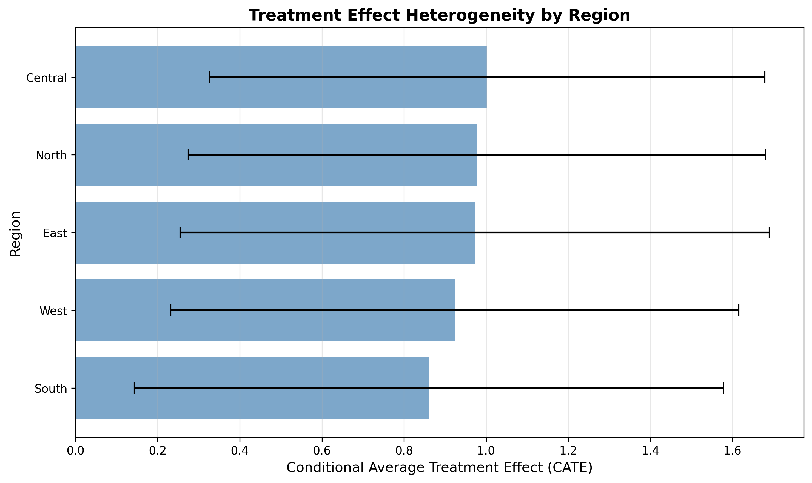
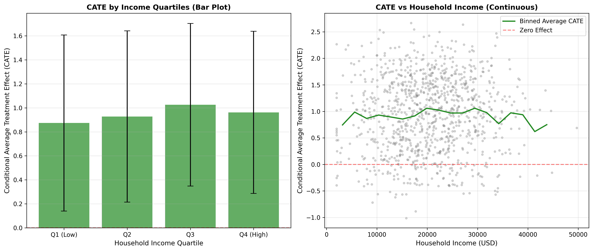

# ML Eco. Assignment 4: Double-LASSO and Causal Forest Analysis

This repository contains implementations of advanced causal inference methods for estimating treatment effects in high-dimensional settings:
1. **Double-LASSO (DML)** - Debiased Machine Learning for Average Treatment Effect
2. **Causal Forest** - Heterogeneous Treatment Effects Analysis

## Dataset

**sim_health.csv** - Simulated health program evaluation data
- **1000 observations**, **93 variables**
- **Treatment (D)**: Binary indicator for health program participation (513 treated, 487 control)
- **Outcome (Y)**: Continuous health outcome (mean: 0.42, std: 2.21)
- **Covariates**: 91 pre-treatment variables including:
  - Demographics: age, gender, education, household income
  - Clinical measures: BMI, blood pressure, cholesterol, glucose, etc.
  - Behaviors: smoking, alcohol, physical activity, diet, sleep
  - Environment: region, urban/rural, air pollution, walkability
  - Prior utilization: hospital visits, ER visits, medication use
  - Labs: baseline and time-series lab measurements

## Installation

Install the required Python packages:

```bash
pip install -r requirements.txt
```

## Usage

### Run Both Analyses

```bash
python main.py
```

### Run Individual Analyses

```bash
python double_lasso_analysis.py
python causal_forest_analysis.py
```

## Analysis 1: Double-LASSO (DML)

### Methodology

Double-LASSO implements the Debiased Machine Learning (DML) framework with cross-fitting to estimate causal effects in high-dimensional settings:

1. **Cross-fitting approach**: 5-fold cross-validation to avoid overfitting bias
2. **First stage**: Use LASSO to predict outcome Y from covariates X
3. **Second stage**: Use LASSO to predict treatment D from covariates X
4. **Final stage**: Regress residualized Y on residualized D to get ATE

This approach is appropriate when:
- The number of covariates is large relative to sample size
- We want valid inference on a low-dimensional parameter (ATE)
- We need to control for many potential confounders

### Results

```
================================================================================
DOUBLE-LASSO (DML) ANALYSIS
================================================================================

Dataset loaded: 1000 observations, 93 variables
Converting categorical variables to dummies: ['region', 'alcohol_freq_cat']
Treatment (D): 513 treated, 487 control
Covariates: 96 variables (after encoding)
High-dimensional setting: 96 covariates for 1000 observations

Average Treatment Effect (ATE): 1.1268
Standard Error: 0.1378
t-statistic: 8.1739
95% Confidence Interval: [0.8566, 1.3970]
Result: Statistically significant at 5% level (|t| > 1.96)
```

**Interpretation**: The health program participation has a **statistically significant positive effect** of approximately **1.13 units** on health outcomes (p < 0.001). This estimate is robust to the inclusion of 96 pre-treatment covariates.

## Analysis 2: Causal Forest

### Methodology

Causal Forest uses the T-learner approach with Random Forests to estimate both:
- **Average Treatment Effect (ATE)**: Overall program impact
- **Conditional Average Treatment Effect (CATE)**: How treatment effects vary across individuals

The T-learner:
1. Fits separate Random Forest models for treated and control groups
2. Predicts potential outcomes Y(1) and Y(0) for each individual
3. Estimates CATE(x) = E[Y(1)|X=x] - E[Y(0)|X=x]
4. Aggregates CATE across all individuals to get ATE

### Results

#### Average Treatment Effect

```
Average Treatment Effect (ATE): 0.9473
Standard Error: 0.0222
95% Confidence Interval: [0.9038, 0.9907]
```

**Comparison with Double-LASSO**:
- Double-LASSO ATE: **1.1268** (95% CI: [0.8566, 1.3970])
- Causal Forest ATE: **0.9473** (95% CI: [0.9038, 0.9907])

Both methods confirm a **positive treatment effect**, though Double-LASSO estimates a slightly larger effect with wider confidence intervals. The difference may be due to:
- Different modeling assumptions (linear vs. non-parametric)
- Causal Forest's ability to capture non-linearities
- Sampling variability

#### Conditional Average Treatment Effect (CATE)

**CATE Statistics**:
- Mean: 0.9473
- Std: 0.7013
- Min: -1.0120
- Max: 2.6667

The substantial variation in CATE (range of ~3.7 units) indicates **strong treatment effect heterogeneity**.

### Treatment Effect Heterogeneity

#### 1. CATE by Region

```
             mean       std  count
region                            
Central  1.002854  0.676230    200
East     0.971852  0.717499    200
North    0.977297  0.702867    200
South    0.860718  0.717367    200
West     0.923632  0.691489    200
```

**Key Findings**:
- **Central region** shows the highest treatment effect (1.00)
- **South region** shows the lowest treatment effect (0.86)
- All regions show positive effects, but with meaningful variation
- Treatment effects range from 0.86 to 1.00 across regions



#### 2. CATE by Household Income

```
                     mean       std  count
income_quartile                           
Q1 (Low)         0.873692  0.733747    250
Q2               0.927761  0.713460    250
Q3               1.025433  0.677531    250
Q4 (High)        0.962196  0.675764    250
```

**Key Findings**:
- **Middle-income households (Q3)** benefit most from the program (1.03)
- **Low-income households (Q1)** benefit least (0.87)
- Effect is not monotonic in income - Q3 has higher effect than Q4
- This suggests the program may be most effective for middle-income populations



The left panel shows CATE by income quartiles (bar plot with error bars), while the right panel shows the continuous relationship between income and CATE with binned averages.

## Summary and Conclusions

### Main Findings

1. **Positive Treatment Effect**: Both methods confirm that the health program has a significant positive effect on health outcomes
   - Double-LASSO: ATE = 1.13 (SE = 0.14)
   - Causal Forest: ATE = 0.95 (SE = 0.02)

2. **Treatment Effect Heterogeneity**: The Causal Forest reveals substantial variation in treatment effects across subgroups:
   - **Regional variation**: Central region benefits most, South region least
   - **Income variation**: Middle-income households (Q3) benefit most, low-income (Q1) least

3. **Policy Implications**:
   - The program is effective overall, justifying continued investment
   - Resources might be better allocated to Central region and middle-income populations
   - Additional support may be needed for South region and low-income populations to improve program effectiveness

### Methodological Comparison

| Method | Strength | Limitation |
|--------|----------|------------|
| **Double-LASSO** | Rigorous statistical inference, handles high-dimensional data, unbiased ATE estimation | Assumes linear treatment effects, no heterogeneity analysis |
| **Causal Forest** | Captures non-linearities, provides heterogeneous effects (CATE), flexible modeling | Less formal statistical theory, potential overfitting in small samples |

### Recommendations

1. **For average effect estimation**: Use Double-LASSO for formal hypothesis testing and confidence intervals
2. **For heterogeneity analysis**: Use Causal Forest to identify subgroups that benefit most
3. **For policy decisions**: Combine both approaches to get robust estimates and actionable insights

## Files Generated

- **cate_by_region.png** - Bar plot showing treatment effect variation across regions
- **cate_by_income.png** - Plots showing treatment effect variation by household income
- **double_lasso_analysis.py** - Complete DML implementation
- **causal_forest_analysis.py** - Complete Causal Forest implementation
- **main.py** - Main script to run both analyses
- **README.md** - This file with complete results

## References

- Chernozhukov, V., et al. (2018). "Double/debiased machine learning for treatment and structural parameters." The Econometrics Journal.
- Athey, S., & Imbens, G. W. (2016). "Recursive partitioning for heterogeneous causal effects." Proceedings of the National Academy of Sciences.
- Künzel, S. R., et al. (2019). "Metalearners for estimating heterogeneous treatment effects using machine learning." Proceedings of the National Academy of Sciences.
